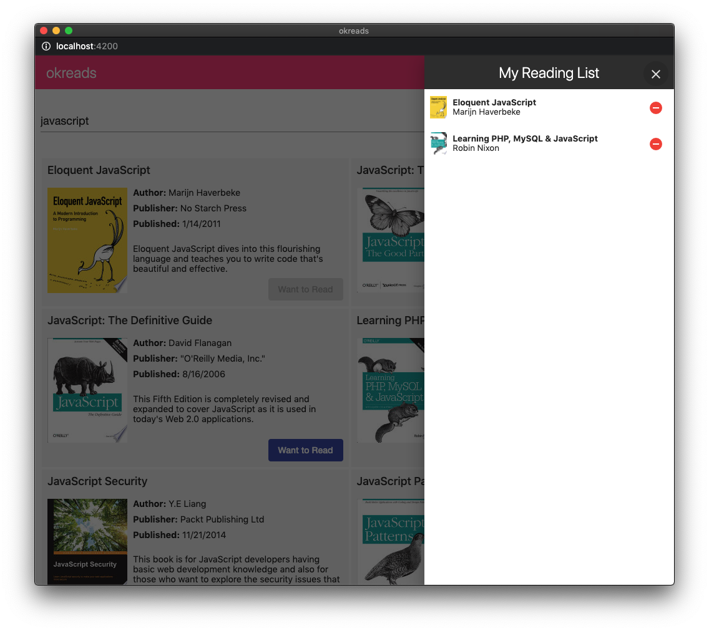

# Dev Test

This dev test tests skills that will be required to contribute to the tos-apps monorepo. 


## Getting Started

Please **DO NOT** clone or fork this repo. Follow the steps below to get started.

1. Go into the extracted folder and run:
   ```
   git init
   git add .
   git commit -m 'initial commit'
   ```
2. Create a _new_ repo on [GitHub](https://github.com)/[GitLab](https://gitlab.com)/[BitBucket](https://bitbucket.org) and push your new repo there.
3. Install dependencies with `npm install`.

You should be able to start the app with `npm start`. The app runs at http://localhost:4200.

### About this app

The app you will be working on is called _okreads_. This app allows you to search for books and add them to your reading list. It is like [goodreads](https://goodreads.com) but lighter on features.

Users can search for books.


Then add them to their reading list.



#### Technologies used

- [Angular](http://angular.io/) - Browser app
- [NgRx](https://ngrx.io/) - State management
- [NestJS](https://docs.nestjs.com/) - API app
- [Nx](https://nx.dev/) - CLI dev tools

### Helpful Hints

- You can see an overview of the architecture by running `npx nx dep-graph`.
- You should not need to modify anything in the `apps/okreads` folder. The `browser` and `api` apps are shells that wrap around projects in the `libs` folder.
- Make sure lint and tests are passing before submitting your code. Write new tests as necessary.
- You can run individual tests by providing the project name as found in `angular.json`. For example,
  ```
  npx nx test books-data-access
  npx nx test books-feature
  ```


### Task 1: Code fixes and review

**Estimated time:** 1 hour

**Push the code changes to branch `code-review`**

1. Create a file named `CODE_REVIEW.md` at the workspace root write a short code review based on the existing code.

   For example,

   - Are there any problems or code smells in the app? (Focus on code in the `libs/books` folder)
   - Are there other improvements you would make to the app? What are they and why?

   Write your review in bullet points. You should list at least three items.

2. [Accessibility](https://webaim.org/intro/) is an important feature of all public facing websites.

   - In Google Chrome, run an automated scan with the Lighthouse extension. [Lighthouse](https://chrome.google.com/webstore/detail/lighthouse/blipmdconlkpinefehnmjammfjpmpbjk), note these issues.
   - In Chrome again, manually check for accessibility issues. Identify at least 3 issue, not found in the automated scan.

3. Fix _at least one_ of the issues noted in step 2 and _all_ the issues from step 3.
4. Run lint, unit tests, and e2e tests. Fix anything that fails.

   ```
   npm run lint
   npm run test
   npm run e2e
   ```

   > **Note:** For the e2e tests to work the app must be running (`npm start`).
   > If you want to keep the test runner open, use `npm run e2e:watch`

5. Commit your changes to the feature branch `code-review`

**Note:** You should now have two commits on `master`. For example, you should see something similar to the following in git.

```
$ git log --oneline
bbbbbbb (HEAD -> master) chore: add code review and fix tests
aaaaaaa initial commit
```

### Task 2: Adding instant search

**Estimated time:** 1 hour

**Requirements**

> As a user, I want to see book results as I am typing in the search field -- I don't want to have to submit the form.
**Push the code changes to branch called `instant-search`**

1. Update the code to provide instant search results as the user is typing. Be sure not to spam the API with too many calls -- no more than one request every 500 ms.
2. Open the e2e test file `apps/okreads-e2e/src/specs/search-books.spec.ts`. Enable the second spec by renaming `xit` to `it`, then implement the test to ensure instant search works.
3. Commit your changes to the feature branch and open a pull-request with `chore/code-review` as the target.


